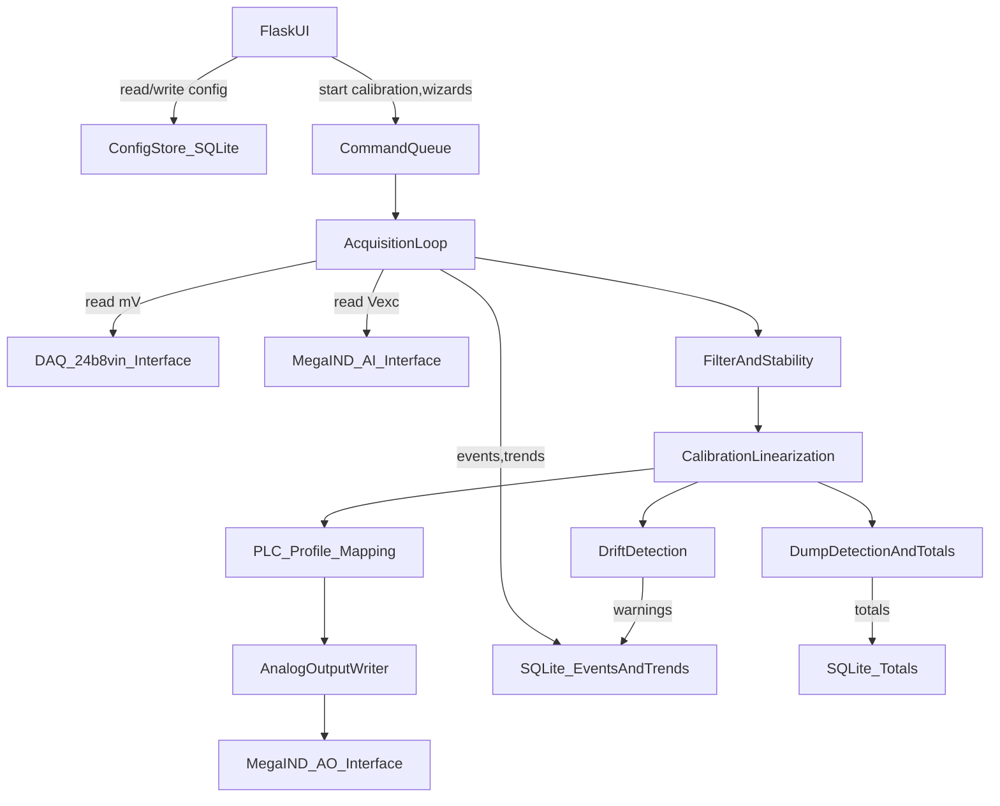

# Raspberry Pi Load Cell Scale Transmitter — Repo Scaffold Plan

## Goals

- Deliver a **new repo scaffold** with a **minimal runnable Flask app in simulated mode**, a **background acquisition/output service**, SQLite persistence, and complete `/docs` engineering documents.
- Keep hardware access behind **dependency-injected interfaces** so the same core logic runs with **simulated hardware** on a PC and later with real Sequent libraries on a Pi.
- Encode your confirmed constraints:
  - Load cells default: **4-wire full bridge, ~3 mV/V**.
  - PLC outputs: **separate physical outputs** for **0–10V** vs **4–20mA**; store **separate PLC correction curves** per mode.

## Repository layout to create

- `src/`
  - `app/` Flask web UI (server-rendered templates)
  - `core/` filtering, stability, calibration linearization, PLC profile mapping, dump detection, drift detection
  - `hw/` hardware interfaces + simulated + Sequent stubs
  - `db/` SQLite schema, migrations/bootstrapping, repositories
  - `services/` background acquisition loop, output writer, watchdog hooks
- `docs/` all engineering documents requested
- `scripts/` install/run/export helpers (offline-friendly)
- `systemd/` example unit
- `requirements.txt`, `README.md`

## High-level runtime architecture

- **One long-running background service** (threaded) independent from Flask:
  - reads 24-bit DAQ channels (per enabled load cell)
  - reads excitation voltage (MegaIND analog input)
  - computes ratiometric signal (optional), filters, stability detection
  - updates SQLite with trends/events
  - computes commanded PLC analog output (including optional PLC correction curve)
  - writes analog output to MegaIND (or sim)
- Flask only reads state from the service + DB and writes config/calibration commands.

## Key design decisions (scaffold level)

- **Config**: stored in SQLite as versioned JSON blobs + `updated_at`, with a strongly-typed `dataclass` view layer.
- **Migrations**: lightweight internal migrations (`db/migrations/*.py`) with a `schema_version` table; no Alembic required.
- **Filtering**: IIR low-pass + stability detector (windowed stddev/derivative). Default response target ~250 ms via configurable cutoff/alpha.
- **Calibration**: multi-point piecewise-linear interpolation; accepts points only when stable.
- **PLC profile mapping**: piecewise-linear mapping that returns “what analog value to output so PLC displays the true weight.” Stored separately for `0_10V` and `4_20mA`.
- **Fault handling**: excitation thresholds + DAQ sanity checks + internal exception supervision; on fault, force **safe output** (0V or 4mA) and persist event.
- **Simulated hardware mode**: selected via config/env; sim models vibration + drift + excitation sag so UI and logic are testable on a PC.

## Files to implement (representative, not exhaustive)

- Flask app
  - [`src/app/__init__.py`](src/app/__init__.py) app factory + DI wiring
  - [`src/app/routes.py`](src/app/routes.py) dashboard/calibration/plc-profile/config/logs skeleton routes
  - [`src/app/templates/*.html`](src/app/templates) lightweight server-rendered pages
- Core logic
  - [`src/core/filtering.py`](src/core/filtering.py) IIR + stability detector
  - [`src/core/calibration.py`](src/core/calibration.py) piecewise-linear calibration
  - [`src/core/plc_profile.py`](src/core/plc_profile.py) piecewise-linear PLC correction
  - [`src/core/drift.py`](src/core/drift.py) contribution ratio tracking + threshold alarms
  - [`src/core/dump_detection.py`](src/core/dump_detection.py) dump detection + totals
- Hardware abstraction
  - [`src/hw/interfaces.py`](src/hw/interfaces.py) DAQ/MegaIND interfaces
  - [`src/hw/simulated.py`](src/hw/simulated.py) simulated signals, buttons, outputs
  - [`src/hw/sequent_24b8vin_stub.py`](src/hw/sequent_24b8vin_stub.py) placeholder wrapper
  - [`src/hw/sequent_megaind_stub.py`](src/hw/sequent_megaind_stub.py) placeholder wrapper
- Services
  - [`src/services/acquisition.py`](src/services/acquisition.py) acquisition thread + exception containment
  - [`src/services/output_writer.py`](src/services/output_writer.py) clamping + safe output behavior
  - [`src/services/state.py`](src/services/state.py) shared state snapshot for UI
- SQLite
  - [`src/db/schema.py`](src/db/schema.py) DDL strings
  - [`src/db/migrate.py`](src/db/migrate.py) migrations runner
  - [`src/db/repo.py`](src/db/repo.py) persistence helpers for events/trends/totals/config
- Ops
  - [`scripts/run_dev.ps1`](scripts/run_dev.ps1) Windows dev run (sim)
  - [`scripts/run_pi.sh`](scripts/run_pi.sh) Pi run
  - [`scripts/export_logs.py`](scripts/export_logs.py) CSV/JSON export
  - [`systemd/loadcell-transmitter.service`](systemd/loadcell-transmitter.service) example unit
- Docs
  - [`docs/SRS.md`](docs/SRS.md), [`docs/Architecture.md`](docs/Architecture.md), [`docs/WiringAndCommissioning.md`](docs/WiringAndCommissioning.md), [`docs/CalibrationProcedure.md`](docs/CalibrationProcedure.md), [`docs/TestPlan.md`](docs/TestPlan.md), [`docs/RiskRegister.md`](docs/RiskRegister.md), [`docs/MaintenanceAndTroubleshooting.md`](docs/MaintenanceAndTroubleshooting.md)

## Acceptance criteria for the scaffold

- `python -m src.app` (or provided script) starts Flask + background service in **simulated mode**.
- Dashboard shows **live total weight**, **per-cell raw/filtered**, **excitation V**, **output mode**, **fault status**.
- Calibration and PLC Profile pages allow adding points (enforcing stability before accept).
- SQLite file is created automatically and logs events/trends/totals.
- No hardware libraries required to run in simulated mode.

## Next step

- After you approve this plan, I will generate the full file tree and initial contents for all docs + code files in the workspace.