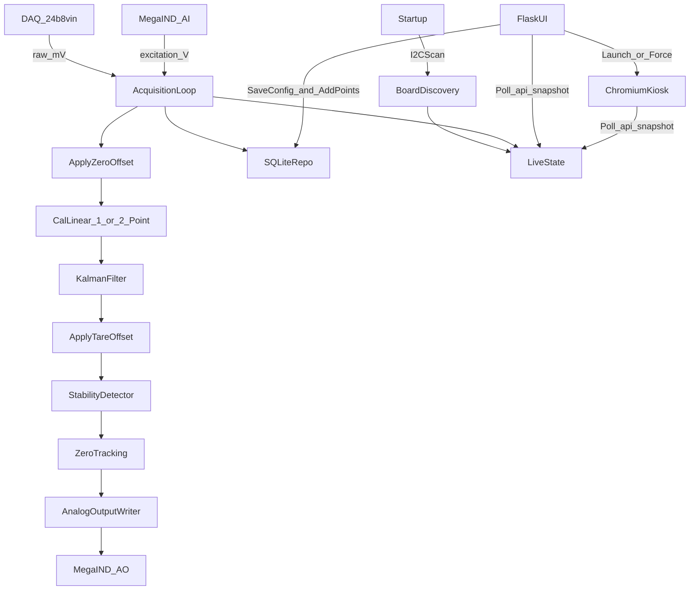

# Architecture

## 🎯 LIVE SYSTEM (December 18, 2025)

**Dashboard:** http://172.16.190.25:8080

| Component | Status | Details |
|-----------|--------|---------|
| **Flask Service** | ✅ Running | `loadcell-transmitter.service` |
| **24b8vin DAQ** | ✅ Online | I2C 0x31, Firmware 1.4 |
| **MegaIND I/O** | ✅ Online | I2C 0x50, Firmware 4.08 |
| **Hardware Mode** | ✅ REAL | Live load cell readings |

---

## 1. Overview
The system is split into three layers:
- **Hardware layer (`src/hw/`)**: Interfaces and **Real Sequent drivers** (via `smbus2`). System always uses real hardware with automatic retry if offline.
- **Core logic (`src/core/`)**: Filtering, stability, zero tracking, and zeroing helpers. No direct hardware/DB calls.
- **Services/UI (`src/services/`, `src/app/`)**: Background acquisition loop, analog output writer, SQLite repositories, Flask web UI, and **HDMI Operator Interface**.

Key principle: **hardware IO is dependency-injected** via `src/hw/factory.py`.

### 1.1 Fixed hardware assumptions
- **Physical stack order**:
  - Raspberry Pi 4B
  - Sequent MegaIND (megaind-rpi) mounted directly on the Pi (bottom, closest to Pi)
  - Sequent 24b8vin (24b8vin-rpi) stacked on top of the MegaIND (top)
  - Sequent Super Watchdog (provides power + UPS)
  - **HDMI Display**: Elecrow 5" 800x480 touch display connected via HDMI + USB (for touch).
- **Communications**: all boards communicate with the Raspberry Pi exclusively over the Pi’s **I2C bus** (I2C port).
- **Driver Stack**:
  - `megaind-rpi` (CLI + Python) for MegaIND
  - `24b8vin-rpi` (CLI + Python `SM24b8vin`) for DAQ
  - **New**: `src/hw/sequent_*.py` drivers wrap these for direct app integration.
  - **Kiosk**: Chromium-browser in kiosk mode for the HDMI display.

### 1.2 Verified I2C Configuration (December 18, 2025)

| Board | I2C Base Address | Stack 0 Address | Firmware | Status |
|-------|------------------|-----------------|----------|--------|
| **MegaIND** | 0x50 | **0x50** | v04.08 | ✅ Verified |
| **24b8vin** | 0x31 | **0x31** | v1.4 | ✅ Verified |

**I2C Bus Scan Result:**
```
$ sudo i2cdetect -y 1
     0  1  2  3  4  5  6  7  8  9  a  b  c  d  e  f
30: -- 31 -- -- -- -- -- -- -- -- -- -- -- -- -- -- 
50: 50 -- -- -- -- -- -- -- -- -- -- -- -- -- -- -- 
```

**No address conflict:** MegaIND (0x50–0x57) and 24b8vin (0x31–0x38) use different address ranges. Both can use stack ID 0 simultaneously.

### 1.3 Pi Connection Details

| Property | Value |
|----------|-------|
| **Hostname** | `Hoppers` |
| **IP Address** | `172.16.190.25` |
| **Dashboard URL** | http://172.16.190.25:8080 |
| **Network** | `Magni-Guest` |
| **OS** | Debian GNU/Linux (aarch64), Kernel 6.12.47 |
| **SSH** | Enabled, running on port 22 |

### 1.4 HDMI Operator Interface (Updated Feb 2026)
- **HDMI Page**: `/hdmi` route serving a touch-optimized UI.
- **Layout**: Two-column 800x480 layout with centered live-weight card and right-side daily/shift placeholder totals panel.
- **Weight Metadata**: HDMI card mirrors dashboard zero diagnostics (`Tare`, `Zero Offset`, `Zero Tracking`, `Zero Updated`) from `/api/snapshot`.
- **Kiosk Service**: `kiosk.service` (systemd user unit) auto-launches Chromium to `/hdmi` at boot.
- **Remote Launch**: Dashboard includes buttons to trigger or force-relaunch the kiosk browser on the Pi display.
- **Resolution**: Fixed 800x480 layout for industrial touch panels.

### 1.5 Load Cell Architecture (Updated Feb 2026)
**Single-Channel Summing Mode:**
- All load cells are wired to a **Summing Board** (Junction Box).
- The Summing Board outputs a single combined signal.
- This signal is wired to **DAQ Channel 1**.
- **Software Implication:** Acquisition loop reads Channel 1 as the "Total Raw Signal". Channels 2-8 are disabled.
- **Trade-off:** Simplifies wiring but removes ability to detect individual load cell drift/failure in software.

## 2. Processes and Threads
- **Main process**: single Python process.
- **Background acquisition thread**: periodic loop (target configurable rate) that:
  - reads DAQ channels (mV)
  - reads excitation analog input (V)
  - applies zero offset (baseline drift correction)
  - applies weight calibration (single-point or two-point linear)
  - filters with Kalman and detects stability
  - applies tare offset (weight domain)
  - runs zero tracking state machine (auto drift correction)
  - computes PLC analog output command and writes to MegaIND AO
  - persists trends/events/totals into SQLite
- **Flask thread pool** (waitress):
  - Serves UI templates (initial render).
  - Serves **JSON API** (`/api/snapshot`) for client-side polling.
  - Handles configuration/calibration commands.
  - **HDMI Control API**: `/api/hdmi/launch` and `/api/hdmi/force-launch` for remote kiosk management.
- **Chromium Process**: Independent browser process running in kiosk mode, managed by `kiosk.service`.

### 2.1 Channel enablement invariant (required)
The acquisition loop and all downstream logic shall treat **disabled DAQ channels** as non-participating data sources. Disabled channels must not affect:
- totals
- drift checks
- stability checks
- alarms/fault logic based on load-cell signals

## 3. Data Flow



## 4. Key Modules
### 4.1 `src/services/acquisition.py`
- Owns the loop timing, hardware reads, exception containment, and update of a shared `LiveState`.
- Performs defensive programming:
  - catches hardware exceptions
  - logs event to DB
  - sets fault state and drives safe output
- **Role Resolver**: Dynamically identifies which physical pins are assigned to system roles (e.g. PLC Weight, Excitation Monitor).
- **Calibration Overrides**: Suspends weight-based output during calibration to allow manual signal "nudging."

### 4.2 `src/services/output_writer.py`
- Converts desired weight to analog output based on:
  - clamping to min/max range
  - output mode (0–10V vs 4–20mA)
  - **Proportional Mapping**: linear scaling from configured weight range to output span.
  - optional deadband and ramp limiting
- Implements safe output policy on fault.

### 4.3 `src/core/filtering.py`
- **Kalman Filter** (Preferred): Zero-lag optimal estimation
- **StabilityDetector**: Windowed stddev + slope thresholds
- **MedianFilter**: Spike rejection (optional)
- **NotchFilter**: 50/60 Hz rejection (optional)

### 4.4 `src/core/zero_tracking.py`
- **ZeroTracker**: State machine for auto drift correction
- **Safety gates**: hold timer, deadband, range limit, spike detection
- **Rate limiting**: Smooth gradual corrections (0.1 lb/s max)
- **Persistence throttling**: Reduces SD card wear

### 4.5 `src/core/zeroing.py`
- **compute_zero_offset()**: Manual ZERO baseline calculation
- **calibration_zero_signal()**: Find 0 lb point in calibration
- **estimate_lbs_per_mv()**: Extract calibration slope
- Calibration helpers provide zero-point lookup and slope estimation for runtime mapping.

### 4.6 `src/db/repo.py` + calibration points
- Stores calibration points (signal -> known weight) in SQLite.
- Captures are append-only; same-weight rows are preserved as history.
- Runtime currently uses one-point or two-point linear calibration derived from endpoint points.

### 4.7 Excitation + fault handling
- Acquisition loop reads configured MegaIND analog input for excitation health when `cfg.excitation.enabled` is true.
- Warn/fault thresholds are configurable in `cfg.excitation`.
- DAQ offline and MegaIND offline always drive the fault model; excitation fault contributes only when excitation monitoring is enabled.

## 5. SQLite Data Model (scaffold-level)
- `schema_version`: DB schema version
- `config_versions`: versioned config JSON blobs
- `events`: faults/warnings/info events with details JSON
- `calibration_points`: saved calibration points (signal, known weight, legacy `ratiometric` flag)
- `plc_profile_points`: optional PLC mapping curve points (used when 2+ points exist for active mode; otherwise linear range fallback is used)
- `trends_excitation`: excitation voltage samples
- `trends_channels`: per-channel raw and filtered signals
- `trends_total`: total weight samples with stability flag
- `production_totals`: daily/weekly/monthly/yearly totals
- `production_dumps`: detected dump events

## 6. Fault Model (high-level)
Fault sources include:
- **Board Missing/Conflict**: I2C discovery failed to find required boards at expected addresses.
- **Excitation Low/Fault**: excitation below configured thresholds.
- **DAQ Error**: reading out-of-range / invalid / I/O failure.
- **Internal Error**: unhandled exception (caught and logged).

Fault actions:
- force safe analog output (0V or 4mA)
- set UI fault flag
- log event to SQLite

## 7. Future Enhancements (not required for scaffold)
- Kalman filtering option
- Authentication and role-based UI access
- Hardware watchdog integration + systemd watchdog
- Remote backup/export strategies for SD-card wear mitigation


