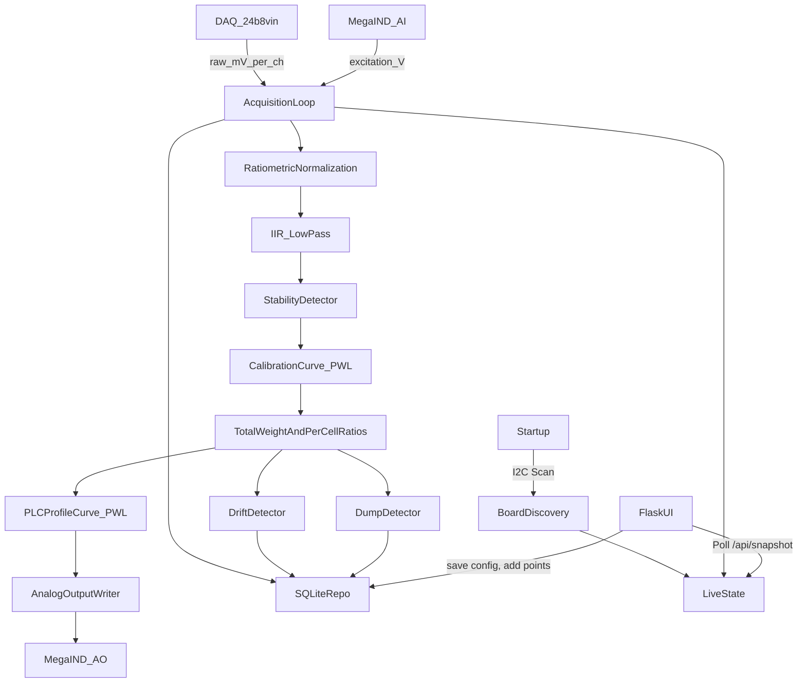

# Architecture

## 🎯 LIVE SYSTEM (December 18, 2025)

**Dashboard:** http://172.16.190.15:8080

| Component | Status | Details |
|-----------|--------|---------|
| **Flask Service** | ✅ Running | `loadcell-transmitter.service` |
| **24b8vin DAQ** | ✅ Online | I2C 0x31, Firmware 1.4 |
| **MegaIND I/O** | ✅ Online | I2C 0x50, Firmware 4.08 |
| **Hardware Mode** | ✅ REAL | Live load cell readings |

---

## 1. Overview
The system is split into three layers:
- **Hardware layer (`src/hw/`)**: Interfaces and **Real Sequent drivers** (via `smbus2`). System always uses real hardware with automatic retry if offline.
- **Core logic (`src/core/`)**: Filtering, stability, calibration, PLC mapping, drift and dump detection. No direct hardware/DB calls.
- **Services/UI (`src/services/`, `src/app/`)**: Background acquisition loop, analog output writer, SQLite repositories, and Flask web UI.

Key principle: **hardware IO is dependency-injected** via `src/hw/factory.py`.

### 1.1 Fixed hardware assumptions
- **Physical stack order**:
  - Raspberry Pi 4B
  - Sequent MegaIND (megaind-rpi) mounted directly on the Pi (bottom, closest to Pi)
  - Sequent 24b8vin (24b8vin-rpi) stacked on top of the MegaIND (top)
  - Sequent Super Watchdog (provides power + UPS)
- **Communications**: all boards communicate with the Raspberry Pi exclusively over the Pi’s **I2C bus** (I2C port).
- **Driver Stack**:
  - `megaind-rpi` (CLI + Python) for MegaIND
  - `24b8vin-rpi` (CLI + Python `SM24b8vin`) for DAQ
  - **New**: `src/hw/sequent_*.py` drivers wrap these for direct app integration.

### 1.2 Verified I2C Configuration (December 18, 2025)

| Board | I2C Base Address | Stack 0 Address | Firmware | Status |
|-------|------------------|-----------------|----------|--------|
| **MegaIND** | 0x50 | **0x50** | v04.08 | ✅ Verified |
| **24b8vin** | 0x31 | **0x31** | v1.4 | ✅ Verified |

**I2C Bus Scan Result:**
```
$ sudo i2cdetect -y 1
     0  1  2  3  4  5  6  7  8  9  a  b  c  d  e  f
30: -- 31 -- -- -- -- -- -- -- -- -- -- -- -- -- -- 
50: 50 -- -- -- -- -- -- -- -- -- -- -- -- -- -- -- 
```

**No address conflict:** MegaIND (0x50–0x57) and 24b8vin (0x31–0x38) use different address ranges. Both can use stack ID 0 simultaneously.

### 1.3 Pi Connection Details

| Property | Value |
|----------|-------|
| **Hostname** | `Hoppers` |
| **IP Address** | `172.16.190.15` |
| **Dashboard URL** | http://172.16.190.15:8080 |
| **Network** | `Magni-Guest` |
| **OS** | Debian GNU/Linux (aarch64), Kernel 6.12.47 |
| **SSH** | Enabled, running on port 22 |

### 1.4 Deployment Details (December 18, 2025)

| Path | Description |
|------|-------------|
| `/opt/loadcell-transmitter/` | Application root |
| `/opt/loadcell-transmitter/src/` | Python source code |
| `/opt/loadcell-transmitter/.venv/` | Python virtual environment |
| `/var/lib/loadcell-transmitter/` | Data directory (SQLite DB) |
| `/etc/systemd/system/loadcell-transmitter.service` | Systemd service |

**Service Management:**
```bash
sudo systemctl status loadcell-transmitter   # Check status
sudo systemctl restart loadcell-transmitter  # Restart
sudo journalctl -u loadcell-transmitter -f   # View logs
```

## 2. Processes and Threads
- **Main process**: single Python process.
- **Background acquisition thread**: periodic loop (target configurable rate) that:
  - reads DAQ channels (mV)
  - reads excitation analog input (V)
  - performs ratiometric normalization (optional)
  - filters and detects stability
  - computes total weight and per-channel ratios
  - performs drift detection and dump detection
  - computes PLC analog output command and writes to MegaIND AO
  - persists trends/events/totals into SQLite
- **Flask thread pool** (waitress):
  - Serves UI templates (initial render).
  - Serves **JSON API** (`/api/snapshot`) for client-side polling.
  - Handles configuration/calibration commands.

### 2.1 Channel enablement invariant (required)
The acquisition loop and all downstream logic shall treat **disabled DAQ channels** as non-participating data sources. Disabled channels must not affect:
- totals
- drift checks
- stability checks
- alarms/fault logic based on load-cell signals

## 3. Data Flow



## 4. Key Modules
### 4.1 `src/services/acquisition.py`
- Owns the loop timing, hardware reads, exception containment, and update of a shared `LiveState`.
- Performs defensive programming:
  - catches hardware exceptions
  - logs event to DB
  - sets fault state and drives safe output
- **Role Resolver**: Dynamically identifies which physical pins are assigned to system roles (e.g. PLC Weight, Excitation Monitor).
- **Calibration Overrides**: Suspends weight-based output during calibration to allow manual signal "nudging."

### 4.2 `src/services/output_writer.py`
- Converts desired weight to analog output based on:
  - clamping to min/max range
  - output mode (0–10V vs 4–20mA)
  - **Proportional Mapping**: Uses a piece-wise linear curve to map weight directly to analog values (V/mA) to match PLC displays.
- Implements safe output policy on fault.

### 4.3 `src/core/filtering.py`
- Kalman Filter (Preferred): Zero-lag optimal estimation.
- Simple exponential IIR low-pass (\(y[n] = y[n-1] + \alpha(x[n]-y[n-1])\)).
- Stability detector based on rolling window variability and derivative.

### 4.4 `src/core/calibration.py`
- Stores weight calibration points (signal -> true weight).
- Uses piecewise-linear interpolation to map signal → weight.

### 4.5 `src/core/plc_profile.py`
- Stores "Match Points" (true weight -> commanded V/mA).
- Interpolates desired lbs → analog command so the PLC display exactly matches the scale reading.
- Stored separately per output mode (0-10V or 4-20mA).

### 4.6 `src/core/drift.py`
- Tracks per-channel ratio contribution vs baseline.
- Flags warning if deviation persists above threshold during stable operation.

### 4.7 `src/core/dump_detection.py`
- Detects large negative step from one stable weight plateau to another.
- Adds delta to production totals and logs dump event.

## 5. SQLite Data Model (scaffold-level)
- `schema_version`: DB schema version
- `config_versions`: versioned config JSON blobs
- `events`: faults/warnings/info events with details JSON
- `calibration_points`: saved calibration points (signal, known weight, ratiometric flag)
- `plc_profile_points`: saved PLC profile points per mode
- `trends_excitation`: excitation voltage samples
- `trends_channels`: per-channel raw and filtered signals
- `trends_total`: total weight samples with stability flag
- `production_totals`: daily/weekly/monthly/yearly totals
- `production_dumps`: detected dump events

## 6. Fault Model (high-level)
Fault sources include:
- **Board Missing/Conflict**: I2C discovery failed to find required boards at expected addresses.
- **Excitation Low/Fault**: excitation below configured thresholds.
- **DAQ Error**: reading out-of-range / invalid / I/O failure.
- **Internal Error**: unhandled exception (caught and logged).

Fault actions:
- force safe analog output (0V or 4mA)
- set UI fault flag
- log event to SQLite

## 7. Future Enhancements (not required for scaffold)
- Kalman filtering option
- Authentication and role-based UI access
- Hardware watchdog integration + systemd watchdog
- Remote backup/export strategies for SD-card wear mitigation


